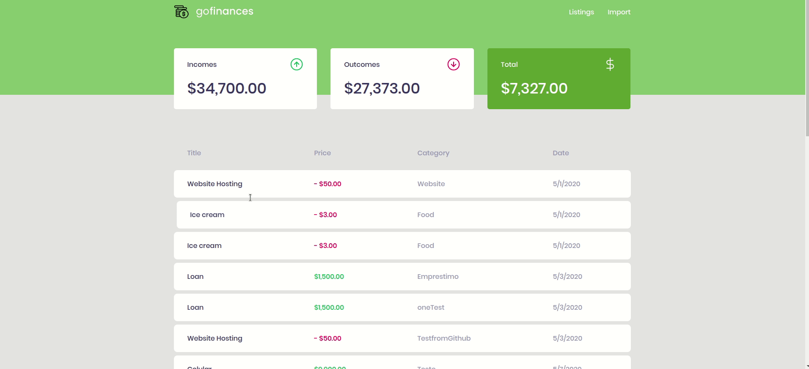

<h2 align="center">
   🌐 GO Finances
</h2>

🇺🇸 This program was made using React, it is an interface for the [challenge 06](https://github.com/kawaxzx/BootcampGoStack_Challenges/tree/master/NodeJS_TypeORM) API that I made in Gostack Bootcamp, it allows viewing the transactions made, and allows importing CSV files :)

🇧🇷 Essa programa foi feito usando React, é uma interface para a API que fiz no [desafio 06](https://github.com/kawaxzx/BootcampGoStack_Challenges/tree/master/NodeJS_TypeORM) do Bootcamp Gostack, ela permite visualizar as transações feitas, e permite importar arquivos CSV :)

<h3 align="center" font="bold"> Interface Funcionando 💻</h3>

# 📚 Development
## The project was made using these technologies to help with development

  [React](https://reactjs.org/)

  [StyledComponents](https://styled-components.com/)

  [TypeScript](https://www.typescriptlang.org/)

